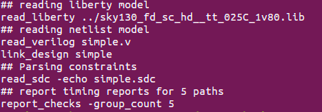
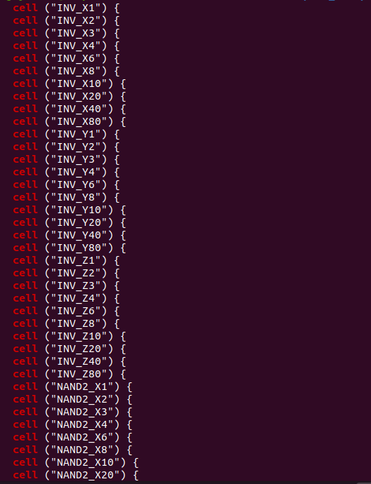

# OpenSTA_labs


# Day 1 :

# Lab_1 : About OpenSTA
OpenSTA is a gate level static timing verifier. As a stand-alone executable it can be used to verify the timing of a design using standard file formats like :-

-Verilog netlist
-Liberty library
-SDC timing constraints
-SDF delay annotation
-SPEF parasitics

OpenSTA is architected to be easily bolted on to other tools as a timing engine.

By using a network adapter, OpenSTAcan access the host netlist data structures without duplicating them.

Query based incremental update of delays, arrival and required times & Simulator to propagate constants from constraints and netlist tie high/low

Reference for commands used in OpenSTA :


https://raw.githubusercontent.com/The-OpenROAD-Project/OpenSTA/master/doc/OpenSTA.pdf

# Lab_1 : Inputs to OpenSTA
```
cd lab1
simple.v
```


Liberty File : Standards Cells Information is present in `liberty` or `.lib` file
.lib life


# Lab_1 : run OpenSTA

Following files shows the steps to read all the above inputs & perform the timing check


Run 'sta run.tcl'




Following the command use to run OpenSTA

'sta run.tcl -exit | tee run1.log'

After the execution of above command , all inputs are being read as show in below image :-


Reports the Timing results in below image


# Day2 : 


# Lab_2 : Liberty Files

The .lib file is an ASCII representation of the timing & power parameters associated with any cell in a particular semiconductor technology

It contains the information like :- -I/O delay paths -Timing check values -Interconnect delays

Following the command to read liberty file in OpenSTA :-

read_liberty 

# Lab_2 : Exercise 1

"Find all cells in simple_max.lib" Total 211 cells are present 

'simple_max.lib'



"Find all pins of 'NAND2_X1' All pins w.r.t 'NAND2_X1' & their direction can be found from lib file as shown below :- 


"Find Different between NAND2_x1 & NAND3_X1" Difference between NAND2_x1 & NAND3_X1 is highlighted in below image :-


# Lab_2 : Exercise 2


# Day3 :


# Lab_3 : Understanding Slack Compulation

Following the circuit provided to perform the slack compulation calculation


Following snap shows the command & inputs used for slack computation :- 'report_checks -from F1/CK'

Run 'run.tcl'


This will report slack compulation w.r.t that path as shown in below image :-


'report_checks -from F1/CK -endpoint_count 100'


# Day4 :


# Lab_4 : Clock Gating Check

Open 's27.v'


# Lab 4 : Async Pin Check


# Day5 :


# lab_5 :slack computation


from the above figure we have to analyze the path in the report of the slack

Type 'cd lab3'
• Run ‘sta run.tcl -noexit | tee out.txt’


# exercise 
'report_checks –from F1/CK -endpoint_count 100'


commom path pesimism removal('CRPR')
Type 'cd lab4'
• Run 'sta run.tcl –exit | out.txt’'
' report_checks –to F2/D'


with set sta_crpr_enabled 1 : 
'''
• set sta_crpr_enabled 1
% report_checks -to F2/D
'''


# ECO INSERTION

cd lab5 and run.tcl

Run 'sta run.tcl –exit | tee run.log'


# diff between s27.v and s27_eco.v


